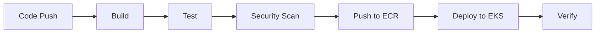

# 🚀 ACME Inc. DevOps Infrastructure and Deployment Plan

<div align="center">


</div>

## 📋 Overview

This repository outlines the proposed infrastructure, deployment strategy, and CI/CD implementation for ACME Inc.'s SaaS product, **AcmeDemeter**. The goal is to transition from the current manual deployment process to a scalable, secure, and automated Kubernetes-based infrastructure on AWS EKS.

## 📑 Table of Contents
- [🏗️ Architecture Overview](#architecture-overview)
- [🔧 Infrastructure Components](#infrastructure-components)
- [🔄 Migration Strategy](#migration-strategy)
- [🔒 Security Implementation](#security-implementation)
- [⚙️ CI/CD Pipeline](#cicd-pipeline)
- [📊 Monitoring and Observability](#monitoring-and-observability)
- [🔄 Disaster Recovery](#disaster-recovery)
- [✨ Best Practices](#best-practices)
- [🚀 Getting Started](#getting-started)

---

## 🏗️ Architecture Overview

Below is the high-level architecture diagram for the proposed infrastructure:


---

## 🔧 Infrastructure Components

### 🌐 Network Infrastructure
- **VPC Design**
  - Multi-AZ deployment for high availability
  - Public and Private subnets
  - NAT Gateway for outbound traffic
  - Network ACLs and Security Groups

### 🐳 Kubernetes Infrastructure
- **EKS Cluster**
  - Managed control plane
  - Node groups with auto-scaling
  - Core infrastructure services
  - Application workloads

### 💾 Data Layer
- **Database**
  - Amazon RDS in Multi-AZ configuration
  - Automated backups and point-in-time recovery
  - Read replicas for scaling

- **Storage**
  - S3 buckets for document storage
  - Lifecycle policies for cost optimization
  - Cross-region replication for DR

### 🔒 Security Components
- AWS WAF for web application firewall
- AWS Secrets Manager for secrets management
- IAM roles and policies
- Pod security policies
- Network security controls

---

## 🔄 Migration Strategy

### Phase 1: Infrastructure Setup
1. **Initial Setup**
   - Create VPC and networking components
   - Deploy EKS cluster
   - Configure core infrastructure services

2. **Security Implementation**
   - Set up IAM roles and policies
   - Configure WAF rules
   - Implement secrets management

### Phase 2: Application Migration
1. **Database Migration**
   - Set up RDS instance
   - Migrate data with minimal downtime
   - Validate data integrity

2. **Service Migration**
   - Containerize applications
   - Deploy to EKS
   - Configure ingress and routing

### Phase 3: CI/CD Implementation
1. **Pipeline Setup**
   - Configure Jenkins/GitHub Actions
   - Set up ECR repositories
   - Implement automated testing

2. **Deployment Automation**
   - Create deployment manifests
   - Implement blue-green deployments
   - Set up monitoring and alerts

### Phase 4: Testing and Validation
1. **Infrastructure Testing**
   - Load testing with k6
   - Security scanning with Trivy
   - Network connectivity testing
   - Failover testing

2. **Application Testing**
   - Integration testing
   - Performance testing
   - Security testing
   - User acceptance testing

3. **Monitoring Validation**
   - Verify metrics collection
   - Test alerting system
   - Validate logging
   - Check dashboard functionality

### Phase 5: DNS and Traffic Migration
1. **DNS Strategy**
   - Create new DNS records for new infrastructure
   - Set up Route53 health checks
   - Configure DNS failover
   - Implement weighted routing

2. **Traffic Migration**
   - Start with 5% traffic to new infrastructure
   - Monitor performance and errors
   - Gradually increase traffic (20%, 50%, 80%)
   - Complete migration to new infrastructure

3. **Rollback Plan**
   - Maintain old infrastructure during transition
   - Keep DNS records for quick rollback
   - Document rollback procedures
   - Test rollback process

---

## 🔒 Security Implementation

### Network Security
- VPC security groups and NACLs
- Private subnets for sensitive workloads
- NAT Gateway for controlled outbound access

### Application Security
- WAF rules for OWASP Top 10
- TLS encryption with cert-manager
- Pod security policies
- Network policies

### Data Security
- Encryption at rest
- Secrets management
- IAM roles and policies
- Regular security audits

---

## ⚙️ CI/CD Pipeline

### Pipeline Overview


### Source Control
- Git repository structure
  - `main` branch for production
  - `develop` branch for development
  - Feature branches for new features
  - Release branches for versioning
- Branch protection rules
  - Require pull request reviews
  - Require status checks to pass
  - Require up-to-date branches
- Code review process
  - Minimum 2 reviewers
  - Automated code quality checks
  - Security scanning

### Build Process
1. **Code Compilation**
   - Build application code
   - Run unit tests
   - Generate artifacts

2. **Container Building**
   - Multi-stage Docker builds
   - Optimize image size
   - Include only necessary components

3. **Security Scanning**
   - Scan dependencies for vulnerabilities
   - Container image scanning
   - SAST (Static Application Security Testing)
   - DAST (Dynamic Application Security Testing)

### Testing Pipeline
1. **Unit Testing**
   - Run unit tests
   - Generate coverage reports
   - Validate test coverage

2. **Integration Testing**
   - Test service interactions
   - Validate API endpoints
   - Check database operations

3. **Performance Testing**
   - Load testing
   - Stress testing
   - Endurance testing

### Deployment Process
1. **Pre-deployment**
   - Backup current state
   - Validate configuration
   - Check dependencies

2. **Deployment**
   - Blue-green deployment strategy
   - Rolling updates
   - Canary releases
   - Feature flags

3. **Post-deployment**
   - Health checks
   - Performance monitoring
   - Error tracking
   - User impact assessment

### Monitoring and Verification
1. **Health Checks**
   - Service health monitoring
   - Database connectivity
   - Cache status
   - External service dependencies

2. **Performance Metrics**
   - Response times
   - Error rates
   - Resource utilization
   - Business metrics

3. **Alerting**
   - Configure alert thresholds
   - Set up notification channels
   - Define escalation policies
   - Monitor alert effectiveness

---

## 📊 Monitoring and Observability

### Metrics Collection
- Prometheus for metrics
- Custom metrics
- Alert rules

### Logging
- Fluentd for log collection
- Elasticsearch for storage
- Kibana for visualization

### Alerting
- Alert manager configuration
- Notification channels
- Escalation policies

---

## 🔄 Disaster Recovery

### Backup Strategy
- Database backups
- S3 bucket replication
- Configuration backups

### Recovery Procedures
- RTO and RPO definitions
- Recovery testing
- Failover procedures

---

## ✨ Best Practices

### Infrastructure
- Infrastructure as Code (Terraform)
- Version control for configurations
- Regular updates and patches

### Security
- Least privilege principle
- Regular security audits
- Compliance monitoring

### Operations
- Automated testing
- Monitoring and alerting
- Incident response procedures

---

## 🚀 Getting Started

### Prerequisites
1. **Development Environment**
   - macOS/Linux/Windows
   - Git
   - Docker Desktop
   - VS Code with extensions:
     - Kubernetes
     - Docker
     - Terraform
     - AWS Toolkit

2. **Cloud Tools**
   - AWS CLI configured
   - AWS credentials set up
   - kubectl installed
   - Terraform installed
   - Helm installed

3. **Access Requirements**
   - AWS account with appropriate permissions
   - GitHub account
   - Access to ECR repositories
   - Access to EKS clusters

### Local Development Setup
1. **Repository Setup**
   ```bash
   # Clone the repository
   git clone https://github.com/acme-inc/acme-lab.git
   cd acme-lab

   # Install dependencies
   make setup
   ```

2. **AWS Configuration**
   ```bash
   # Configure AWS credentials
   aws configure

   # Set up kubectl
   aws eks update-kubeconfig --name acme-cluster --region us-west-2
   ```

3. **Infrastructure Setup**
   ```bash
   # Initialize Terraform
   cd terraform
   terraform init

   # Plan infrastructure changes
   terraform plan

   # Apply infrastructure
   terraform apply
   ```

### Application Development
1. **Building Applications**
   ```bash
   # Build container images
   make build

   # Run tests
   make test

   # Push to ECR
   make push
   ```

2. **Local Testing**
   ```bash
   # Start local environment
   make local-up

   # Run integration tests
   make integration-test

   # Stop local environment
   make local-down
   ```

### Deployment Process
1. **Development Deployment**
   ```bash
   # Deploy to development
   make deploy-dev

   # Verify deployment
   make verify-dev
   ```

2. **Production Deployment**
   ```bash
   # Deploy to staging
   make deploy-staging

   # Run smoke tests
   make smoke-test

   # Deploy to production
   make deploy-prod
   ```

### Monitoring and Maintenance
1. **Access Monitoring**
   ```bash
   # Open Grafana dashboard
   make dashboard

   # View logs
   make logs

   # Check metrics
   make metrics
   ```

2. **Maintenance Tasks**
   ```bash
   # Update dependencies
   make update-deps

   # Backup data
   make backup

   # Clean up resources
   make cleanup
   ```

### Troubleshooting
1. **Common Issues**
   - Network connectivity problems
   - Authentication issues
   - Resource constraints
   - Deployment failures

2. **Debugging Tools**
   - kubectl debugging commands
   - AWS CloudWatch logs
   - Container logs
   - Network diagnostics

3. **Support Channels**
   - Internal documentation
   - Team communication channels
   - Escalation procedures
   - Emergency contacts

---

## 🤝 Contributing

Please read [CONTRIBUTING.md](CONTRIBUTING.md) for details on our code of conduct and the process for submitting pull requests.

## 📄 License

This project is licensed under the MIT License - see the [LICENSE.md](LICENSE.md) file for details.

---

<div align="center">

Made with ❤️ by ACME Inc. DevOps Team

</div>