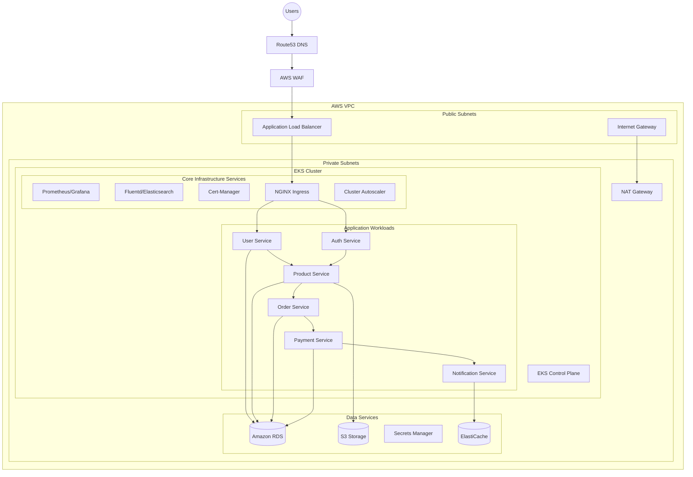
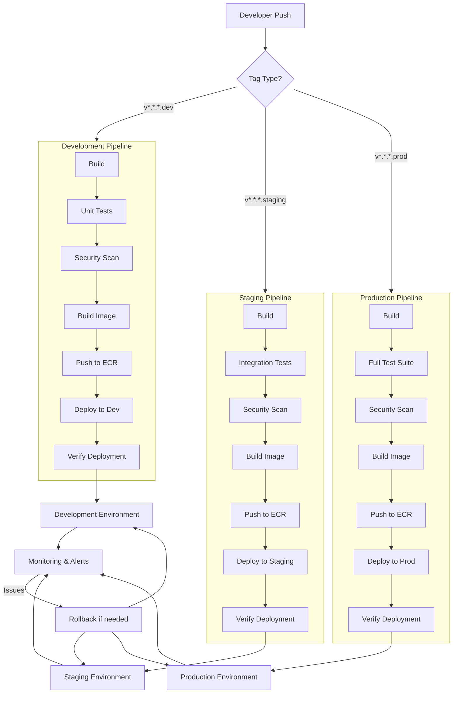

# 🚀 ACME Inc. DevOps Infrastructure and Implementation Plan

This repository contains the DevOps infrastructure implementation for ACME Inc., including the infrastructure plan and the Greet microservice implementation.

## 📋 Repository Structure

- **greet-service/** - Implementation of the Greet microservice, a containerized Flask application with Kubernetes deployment configuration.

## 📑 Table of Contents
- [Architecture Overview](#architecture-overview)
- [Infrastructure Components](#infrastructure-components)
- [Migration Strategy](#migration-strategy)
- [Security Implementation](#security-implementation)
- [CI/CD Pipeline](#cicd-pipeline)
- [Monitoring and Observability](#monitoring-and-observability)
- [Disaster Recovery](#disaster-recovery)
- [Getting Started](#getting-started)

---

## Architecture Overview

Below is the high-level architecture diagram for the proposed infrastructure:

## Infrastructure Components

### 🌐 Network Infrastructure
- **VPC Design**
  - Multi-AZ deployment for high availability
  - Public subnets for ingress/egress traffic
  - Private subnets for application workloads
  - Proper security groups and NACLs
  - **Suggested AWS Services:**
    - AWS VPC
    - Transit Gateway
    - Route Tables
    - Internet Gateway
    - NAT Gateway
    - Network ACLs

### ☸️ Kubernetes Infrastructure
- **EKS Cluster**
  - Managed control plane
  - Worker nodes in private subnets
  - Auto-scaling node groups
  - **Suggested AWS Services:**
    - Amazon EKS
    - EC2 Auto Scaling Groups
    - AWS Fargate (Serverless option)
    - AWS Node Groups

### 💾 Data Layer
- **Database Infrastructure**
  - Multi-AZ RDS for relational data
  - S3 for object storage
  - ElastiCache for caching
  - **Suggested AWS Services:**
    - Amazon RDS (PostgreSQL/MySQL)
    - Amazon Aurora
    - Amazon DynamoDB
    - Amazon ElastiCache
    - Amazon S3
    - AWS Backup

### 🔐 Security Components
- **Access Control**
  - IAM roles for service accounts
  - Pod security policies
  - Network policies
  - **Suggested AWS Services:**
    - AWS IAM
    - AWS WAF
    - AWS Shield
    - AWS Secrets Manager
    - AWS KMS
    - AWS Certificate Manager
    - HashiCorp Vault (Open Source Alternative)

### 💰 Cost Optimization
- **Resource Management**
  - Implement auto-scaling policies
  - Use Spot Instances where applicable
  - Right-size resources based on metrics
  - **Suggested Tools:**
    - AWS Cost Explorer
    - AWS Budgets
    - CloudHealth
    - Kubecost
    - AWS Compute Optimizer

## Migration Strategy

### Phase 1: Infrastructure Setup
1. **Network Infrastructure**
   - Set up VPC and subnets
   - Configure routing and security groups
   - Establish connectivity between zones

2. **EKS Cluster Deployment**
   - Create EKS control plane
   - Deploy worker nodes
   - Install core components

3. **Monitoring and Security**
   - Deploy Prometheus/Grafana
   - Configure logging with Fluentd/Elasticsearch
   - Set up alerting

### Phase 2: Application Migration
1. **Database Migration**
   - Set up target databases
   - Use AWS DMS for data migration
   - Validate data integrity

2. **Application Containerization**
   - Containerize applications
   - Build CI/CD pipelines
   - Implement configuration management

3. **Deployment Process**
   - Create Kubernetes manifests
   - Implement deployment strategies
   - Set up service meshes

### Phase 3: CI/CD Implementation
1. **Pipeline Setup**
   - Source control integration
   - Build configurations
   - Test frameworks

2. **Deployment Automation**
   - Automated testing
   - Deployment triggers
   - Rollback mechanisms

## Security Implementation

### Network Security
- VPC security groups
- Network ACLs
- Private subnets
- WAF rules

### Application Security
- Container security scanning
- Pod security policies
- TLS encryption
- Secret management

### Data Security
- Encryption at rest
- Encryption in transit
- Data classification
- Access controls
- Regular security audits

## CI/CD Pipeline

### Pipeline Overview

## Monitoring and Observability

### Metrics Collection
- Infrastructure metrics
- Application metrics
- Business metrics
- Alerting thresholds

### Logging
- Centralized logging
- Log analysis
- Log retention policies
- Audit logging

### Service Level Objectives (SLOs)
- **Availability Targets**
  - 99.9% service availability
  - < 1s response time for API calls
  - < 0.1% error rate
  - < 5s page load time

## Disaster Recovery

### Backup Strategy
- Database backups
- Configuration backups
- State backups
- Retention policies

### Recovery Procedures
- Recovery Time Objectives (RTO): 4 hours for critical services
- Recovery Point Objectives (RPO): 15 minutes for critical data
- Disaster recovery testing
- Documented procedures

### Multi-Region Strategy
- Active-active configuration
- Regional failover procedures
- Data replication setup
- Traffic routing policies

## Getting Started

### Prerequisites
- AWS account with appropriate permissions
- Kubernetes knowledge
- Infrastructure as Code experience
- CI/CD understanding
- Dev Container for development

### Local Development Setup
1. Install required tools: AWS CLI, kubectl, Terraform, Docker
2. Clone this repository
3. Use Dev Container for consistent development environment

## Components

For more information on the Greet service, see its [README](./greet-service/README.md). 