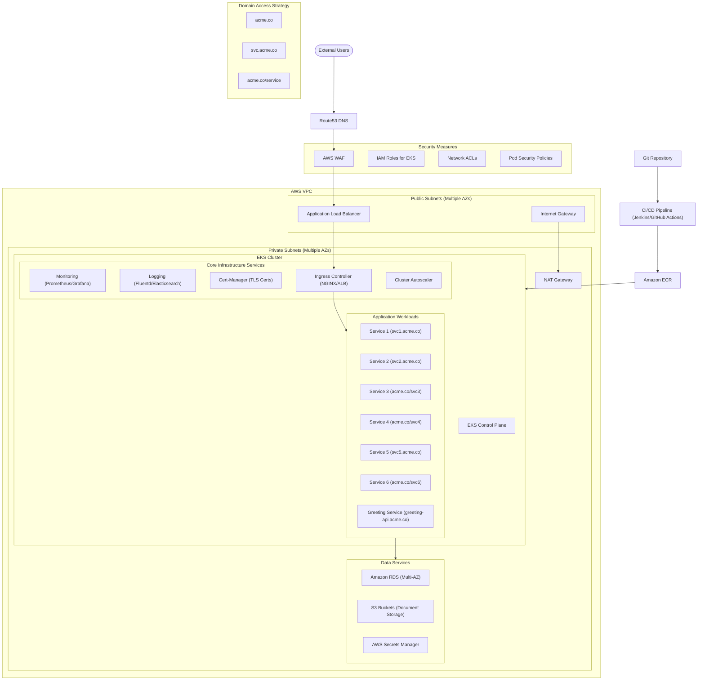
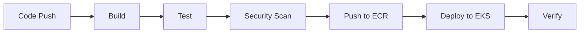

# 🚀 ACME Inc. DevOps Infrastructure and Deployment Plan

<div align="center">


</div>

## 📋 Overview

This repository outlines the proposed infrastructure, deployment strategy, and CI/CD implementation for ACME Inc.'s SaaS product, **AcmeDemeter**. The goal is to transition from the current manual deployment process to a scalable, secure, and automated Kubernetes-based infrastructure on AWS EKS, using GitHub Actions for CI/CD and Dev Containers for development.

## �� Table of Contents
- [🏗️ Architecture Overview](#architecture-overview)
- [🔧 Infrastructure Components](#infrastructure-components)
- [🔄 Migration Strategy](#migration-strategy)
- [🔒 Security Implementation](#security-implementation)
- [⚙️ CI/CD Pipeline](#cicd-pipeline)
- [📊 Monitoring and Observability](#monitoring-and-observability)
- [🔄 Disaster Recovery](#disaster-recovery)
- [✨ Best Practices](#best-practices)
- [🚀 Getting Started](#getting-started)

---

## 🏗️ Architecture Overview

Below is the high-level architecture diagram for the proposed infrastructure:



---

## 🔧 Infrastructure Components

### 🌐 Network Infrastructure
- **VPC Design**
  - Multi-AZ deployment for high availability
  - Public and Private subnets
  - NAT Gateway for outbound traffic
  - Network ACLs and Security Groups

### 🐳 Kubernetes Infrastructure
- **EKS Cluster**
  - Managed control plane
  - Node groups with auto-scaling
  - Core infrastructure services
  - Application workloads

### 💾 Data Layer
- **Database**
  - Amazon RDS in Multi-AZ configuration
  - Automated backups and point-in-time recovery
  - Read replicas for scaling

- **Storage**
  - S3 buckets for document storage
  - Lifecycle policies for cost optimization
  - Cross-region replication for DR

### 🔒 Security Components
- AWS WAF for web application firewall
- AWS Secrets Manager for secrets management
- IAM roles and policies
- Pod security policies
- Network security controls

---

## 🔄 Migration Strategy

### Phase 1: Infrastructure Setup
1. **GitHub Project Setup**
   ```bash
   # Create new GitHub repository
   gh repo create acme-lab --private --source=. --remote=origin

   # Configure branch protection rules
   gh api repos/acme-inc/acme-lab/branches/main/protection \
     --method PUT \
     --field required_status_checks='{"strict":true,"contexts":["build","test","security"]}' \
     --field required_pull_request_reviews='{"required_approving_review_count":2}'
   ```

2. **GitHub Actions Workflow Setup**
   ```yaml
   # .github/workflows/infrastructure.yml
   name: Infrastructure Deployment
   
   on:
     push:
       branches: [main, staging, develop]
     pull_request:
       branches: [main, staging, develop]
   
   jobs:
     deploy:
       runs-on: ubuntu-latest
       environment: ${{ github.ref_name }}
       
       steps:
         - uses: actions/checkout@v3
         
         - name: Configure AWS Credentials
           uses: aws-actions/configure-aws-credentials@v1
           with:
             aws-access-key-id: ${{ secrets.AWS_ACCESS_KEY_ID }}
             aws-secret-access-key: ${{ secrets.AWS_SECRET_ACCESS_KEY }}
             aws-region: us-west-2
             role-to-assume: ${{ secrets.AWS_ROLE_ARN }}
             role-session-name: GitHubActions
   ```

3. **Terraform Project Structure**
   ```
   terraform/
   ├── environments/
   │   ├── dev/
   │   ├── staging/
   │   └── prod/
   ├── modules/
   │   ├── networking/
   │   ├── eks/
   │   ├── rds/
   │   ├── s3/
   │   └── security/
   ├── backend/
   │   └── s3/
   └── variables/
       └── common.tfvars
   ```

4. **Terraform Best Practices**
   - **State Management**
     - Use S3 backend with DynamoDB for state locking
     - Separate state files per environment
     - Enable state encryption
     - Implement state backup strategy

   - **Module Development**
     - Follow module naming convention: `terraform-aws-<module-name>`
     - Include README.md in each module
     - Version modules using semantic versioning
     - Document input/output variables
     - Include examples and tests

   - **Code Organization**
     - Use workspaces for environment separation
     - Implement variable validation
     - Use locals for complex expressions
     - Follow consistent naming conventions
     - Document all variables and outputs

   - **Security Practices**
     - Use AWS KMS for sensitive values
     - Implement least privilege IAM roles
     - Enable encryption at rest
     - Use private endpoints where possible
     - Regular security scanning

5. **Infrastructure Deployment**
   ```bash
   # Initialize Terraform with GitHub Actions
   terraform init -backend-config="bucket=acme-terraform-state" \
                 -backend-config="key=${{ github.ref_name }}/terraform.tfstate" \
                 -backend-config="region=us-west-2"

   # Plan infrastructure
   terraform plan -var-file="environments/${{ github.ref_name }}/terraform.tfvars"

   # Apply infrastructure
   terraform apply -var-file="environments/${{ github.ref_name }}/terraform.tfvars"
   ```

### Phase 2: Application Migration
1. **Database Migration**
   - Set up RDS instance with proper configuration
   - Implement backup strategy
   - Configure monitoring and alerts
   - Set up read replicas
   - Implement connection pooling

2. **Service Migration**
   - Containerize applications
   - Implement health checks
   - Configure resource limits
   - Set up auto-scaling
   - Implement proper logging

### Phase 3: CI/CD Implementation
1. **GitHub Actions Pipeline Setup**
   - **Development Workflow**
     ```yaml
     # .github/workflows/development.yml
     name: Development Deployment
     
     on:
       push:
         branches: [develop]
       pull_request:
         branches: [develop]
     
     jobs:
       deploy:
         runs-on: ubuntu-latest
         environment: development
         
         steps:
           - uses: actions/checkout@v3
           
           - name: Configure AWS Credentials
             uses: aws-actions/configure-aws-credentials@v1
             with:
               aws-access-key-id: ${{ secrets.AWS_ACCESS_KEY_ID }}
               aws-secret-access-key: ${{ secrets.AWS_SECRET_ACCESS_KEY }}
               aws-region: us-west-2
               role-to-assume: ${{ secrets.AWS_ROLE_ARN }}
               role-session-name: GitHubActions
           
           - name: Deploy to Development
             run: |
               make deploy-dev
     ```

   - **Staging Workflow**
     ```yaml
     # .github/workflows/staging.yml
     name: Staging Deployment
     
     on:
       push:
         branches: [staging]
       pull_request:
         branches: [staging]
     
     jobs:
       deploy:
         runs-on: ubuntu-latest
         environment: staging
         
         steps:
           - uses: actions/checkout@v3
           
           - name: Configure AWS Credentials
             uses: aws-actions/configure-aws-credentials@v1
             with:
               aws-access-key-id: ${{ secrets.AWS_ACCESS_KEY_ID }}
               aws-secret-access-key: ${{ secrets.AWS_SECRET_ACCESS_KEY }}
               aws-region: us-west-2
               role-to-assume: ${{ secrets.AWS_ROLE_ARN }}
               role-session-name: GitHubActions
           
           - name: Deploy to Staging
             run: |
               make deploy-staging
     ```

   - **Production Workflow**
     ```yaml
     # .github/workflows/production.yml
     name: Production Deployment
     
     on:
       push:
         branches: [main]
       pull_request:
         branches: [main]
     
     jobs:
       deploy:
         runs-on: ubuntu-latest
         environment: production
         
         steps:
           - uses: actions/checkout@v3
           
           - name: Configure AWS Credentials
             uses: aws-actions/configure-aws-credentials@v1
             with:
               aws-access-key-id: ${{ secrets.AWS_ACCESS_KEY_ID }}
               aws-secret-access-key: ${{ secrets.AWS_SECRET_ACCESS_KEY }}
               aws-region: us-west-2
               role-to-assume: ${{ secrets.AWS_ROLE_ARN }}
               role-session-name: GitHubActions
           
           - name: Deploy to Production
             run: |
               make deploy-prod
     ```

2. **Secrets Management**
   - **AWS Secrets Manager Setup**
     ```bash
     # Create secrets for each environment
     aws secretsmanager create-secret \
       --name acme/dev/credentials \
       --description "Development environment credentials" \
       --secret-string file://dev-credentials.json
     ```

   - **GitHub Secrets Configuration**
     - AWS_ACCESS_KEY_ID
     - AWS_SECRET_ACCESS_KEY
     - AWS_ROLE_ARN
     - KUBECONFIG_DATA
     - ECR_REPOSITORY_URI

### Phase 4: Testing and Validation
1. **Infrastructure Testing**
   - Load testing with k6
   - Security scanning with Trivy
   - Network connectivity testing
   - Failover testing
   - Performance benchmarking

2. **Application Testing**
   - Integration testing
   - Performance testing
   - Security testing
   - User acceptance testing
   - Load testing

3. **Monitoring Validation**
   - Verify metrics collection
   - Test alerting system
   - Validate logging
   - Check dashboard functionality
   - Monitor resource utilization

### Phase 5: DNS and Traffic Migration
1. **DNS Strategy**
   - Create new DNS records
   - Set up Route53 health checks
   - Configure DNS failover
   - Implement weighted routing
   - Set up DNS monitoring

2. **Traffic Migration**
   - Start with 5% traffic
   - Monitor performance
   - Gradually increase traffic
   - Complete migration
   - Monitor user impact

3. **Rollback Plan**
   - Maintain old infrastructure
   - Keep DNS records
   - Document procedures
   - Test rollback process
   - Monitor for issues

---

## 🔒 Security Implementation

### Network Security
- VPC security groups and NACLs
- Private subnets for sensitive workloads
- NAT Gateway for controlled outbound access

### Application Security
- WAF rules for OWASP Top 10
- TLS encryption with cert-manager
- Pod security policies
- Network policies

### Data Security
- Encryption at rest
- Secrets management
- IAM roles and policies
- Regular security audits

---

## ⚙️ CI/CD Pipeline

### Pipeline Overview


### Source Control
- Git repository structure
  - `main` branch for production
  - `develop` branch for development
  - Feature branches for new features
  - Release branches for versioning
- Branch protection rules
  - Require pull request reviews
  - Require status checks to pass
  - Require up-to-date branches
- Code review process
  - Minimum 2 reviewers
  - Automated code quality checks
  - Security scanning

### Build Process
1. **Code Compilation**
   - Build application code
   - Run unit tests
   - Generate artifacts

2. **Container Building**
   - Multi-stage Docker builds
   - Optimize image size
   - Include only necessary components

3. **Security Scanning**
   - Scan dependencies for vulnerabilities
   - Container image scanning
   - SAST (Static Application Security Testing)
   - DAST (Dynamic Application Security Testing)

### Testing Pipeline
1. **Unit Testing**
   - Run unit tests
   - Generate coverage reports
   - Validate test coverage

2. **Integration Testing**
   - Test service interactions
   - Validate API endpoints
   - Check database operations

3. **Performance Testing**
   - Load testing
   - Stress testing
   - Endurance testing

### Deployment Process
1. **Pre-deployment**
   - Backup current state
   - Validate configuration
   - Check dependencies

2. **Deployment**
   - Blue-green deployment strategy
   - Rolling updates
   - Canary releases
   - Feature flags

3. **Post-deployment**
   - Health checks
   - Performance monitoring
   - Error tracking
   - User impact assessment

### Monitoring and Verification
1. **Health Checks**
   - Service health monitoring
   - Database connectivity
   - Cache status
   - External service dependencies

2. **Performance Metrics**
   - Response times
   - Error rates
   - Resource utilization
   - Business metrics

3. **Alerting**
   - Configure alert thresholds
   - Set up notification channels
   - Define escalation policies
   - Monitor alert effectiveness

---

## 📊 Monitoring and Observability

### Metrics Collection
- Prometheus for metrics
- Custom metrics
- Alert rules

### Logging
- Fluentd for log collection
- Elasticsearch for storage
- Kibana for visualization

### Alerting
- Alert manager configuration
- Notification channels
- Escalation policies

---

## 🔄 Disaster Recovery

### Backup Strategy
- Database backups
- S3 bucket replication
- Configuration backups

### Recovery Procedures
- RTO and RPO definitions
- Recovery testing
- Failover procedures

---

## ✨ Best Practices

### Infrastructure
- Infrastructure as Code (Terraform)
- Version control for configurations
- Regular updates and patches

### Security
- Least privilege principle
- Regular security audits
- Compliance monitoring

### Operations
- Automated testing
- Monitoring and alerting
- Incident response procedures

---

## 🚀 Getting Started

### Prerequisites
1. **Development Environment**
   - VS Code with Dev Containers extension
   - Docker Desktop
   - Git
   - GitHub CLI (gh)

2. **Dev Container Setup**
   ```json
   // .devcontainer/devcontainer.json
   {
     "name": "ACME Lab Development",
     "dockerFile": "Dockerfile",
     "customizations": {
       "vscode": {
         "extensions": [
           "ms-azuretools.vscode-docker",
           "hashicorp.terraform",
           "redhat.vscode-yaml",
           "ms-kubernetes-tools.vscode-kubernetes-tools"
         ]
       }
     },
     "forwardPorts": [3000, 8080],
     "postCreateCommand": "pre-commit install",
     "remoteUser": "vscode"
   }
   ```

3. **Local Development Workflow**
   ```bash
   # Clone repository
   git clone https://github.com/acme-inc/acme-lab.git
   cd acme-lab

   # Create feature branch
   git checkout -b feature/your-feature-name

   # Open in Dev Container
   code .  # VS Code will prompt to reopen in container

   # Make changes and commit
   git add .
   git commit -m "feat: your feature description"

   # Push changes
   git push origin feature/your-feature-name

   # Create pull request
   gh pr create --title "Your Feature" --body "Description"
   ```

4. **Environment Setup**
   ```bash
   # Configure AWS credentials in Dev Container
   aws configure

   # Set up kubectl
   aws eks update-kubeconfig --name acme-cluster --region us-west-2

   # Verify setup
   kubectl get nodes
   aws sts get-caller-identity
   ```

### Application Development
1. **Building Applications**
   ```bash
   # Build container images
   make build

   # Run tests
   make test

   # Push to ECR
   make push
   ```

2. **Local Testing**
   ```bash
   # Start local environment
   make local-up

   # Run integration tests
   make integration-test

   # Stop local environment
   make local-down
   ```

### Deployment Process
1. **Development Deployment**
   ```bash
   # Deploy to development
   make deploy-dev

   # Verify deployment
   make verify-dev
   ```

2. **Production Deployment**
   ```bash
   # Deploy to staging
   make deploy-staging

   # Run smoke tests
   make smoke-test

   # Deploy to production
   make deploy-prod
   ```

### Monitoring and Maintenance
1. **Access Monitoring**
   ```bash
   # Open Grafana dashboard
   make dashboard

   # View logs
   make logs

   # Check metrics
   make metrics
   ```

2. **Maintenance Tasks**
   ```bash
   # Update dependencies
   make update-deps

   # Backup data
   make backup

   # Clean up resources
   make cleanup
   ```

### Troubleshooting
1. **Common Issues**
   - Network connectivity problems
   - Authentication issues
   - Resource constraints
   - Deployment failures

2. **Debugging Tools**
   - kubectl debugging commands
   - AWS CloudWatch logs
   - Container logs
   - Network diagnostics

3. **Support Channels**
   - Internal documentation
   - Team communication channels
   - Escalation procedures
   - Emergency contacts

---

## 🤝 Contributing

Please read [CONTRIBUTING.md](CONTRIBUTING.md) for details on our code of conduct and the process for submitting pull requests.

## 📄 License

This project is licensed under the MIT License - see the [LICENSE.md](LICENSE.md) file for details.

---

<div align="center">

Made with ❤️ by ACME Inc. DevOps Team

</div>